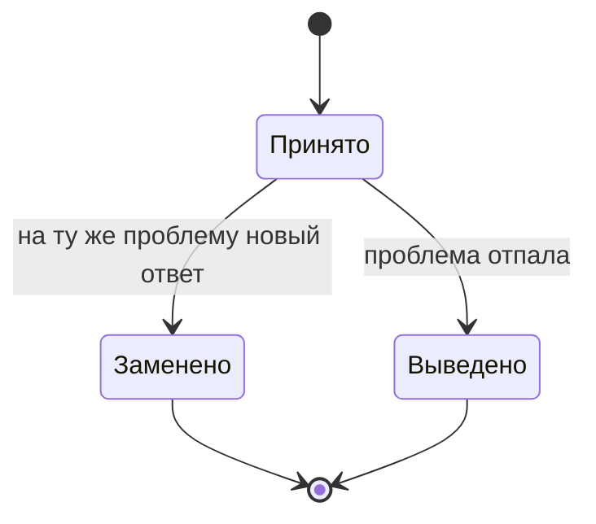

<dec-body>
Состояние актуальности решения сохраняется в его статусе.

Варианты статуса:

1. Решение принято (актуально)
2. Решение заменено (есть преемник)
3. Решение выведено (проблема отпала)

По умолчанию решение принято.

</dec-body>
