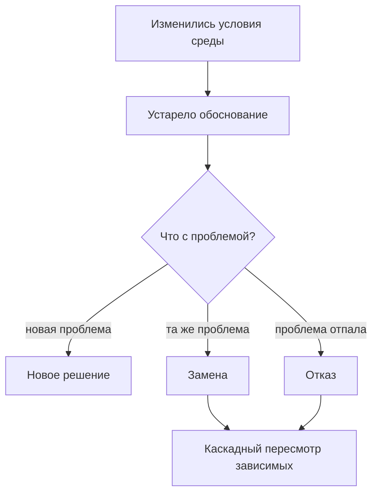

<dec-body>
Система адаптируется под среду:
меняются условия - решения приходится пересматривать.

Изменились условия => устаревают обоснования решений.

Пример изменений условий:
- выросла нагрузка
- изменились требования
- изменились доступные инструменты
- появилось новое знание
    
Пересмотр решения ведет к трем исходам:

- добавление нового решения
- замена старого решения на новое
- отказ от текущего решения
	
В следствии связанности решений друг с другом, пересмотр отдельного решения, может привести к каскадному пересмотру зависимых решений.

</dec-body>
