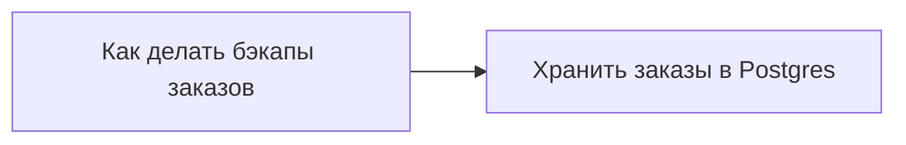

<dec-body>
Одно решение может держаться на другом: изменяя опору решения, его придется пересмотреть. Опору выражает отдельный тип связи.

Направление связи противоположно направлению влияния опоры.

A -> [опирается на] -> B

значит:

B -> [влияет на] -> A

Замена Postgres (решение B) приведет к пересмотру решения A.

Так появляется impact анализ - процесс изучения влияния изменеий.
</dec-body>
