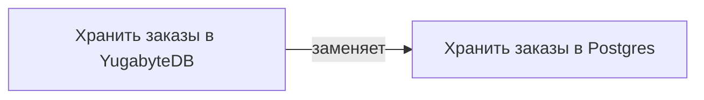

<dec-body>
Решения заменяются новыми через добавление нового решения с обновлением статуса старого решения. Между двумя решениями создается так же связь замены.

A -> [заменяет] -> B

Пример:

Проблема "как хранить заказы" осталась той же, появился новый ответ, потому что Postgres перестал справляться с нагрузкой.
</dec-body>
